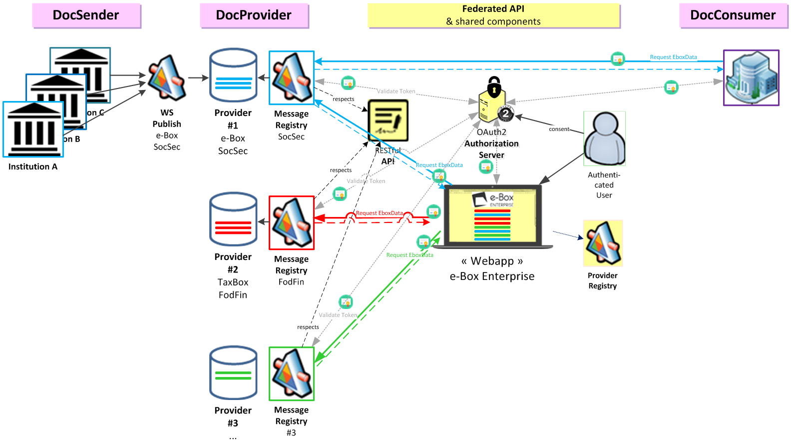

# Tools & Tricks to integrate with e-Box Enterprise
 
An unofficial set of tools that helps with integration with [https://www.eboxenterprise.be](https://www.eboxenterprise.be) site.

- [Integration as Document Provider](document_provider/document_provider.md)
- [Integration as Document Sender](document_sender/document_sender.md)
- [Federation Web Service](federation/federation_ws.md)
- [Notifications and the e-Box Enterptrise Event Service](federation/enterprise_ebox_event_service.md)

The diagram below shows the high-level technical view of the federated model of the e-Box Enterprise. The federated view indeed integrates several message sources (***DocProviders***), each accessible via a MessageRegistry (web service REST) respecting the same [contract](openapi/ebox-rest-2.1.yaml).
In addition, some institutions (***DocSenders***) can continue to publish their messages to a DocProvider who will make them available for the federated e-Box.
Finally, a company (***DocConsumer***) can directly retrieve the content of its e-Box via a technical integration with each MessageRegistry offering this type of access.
