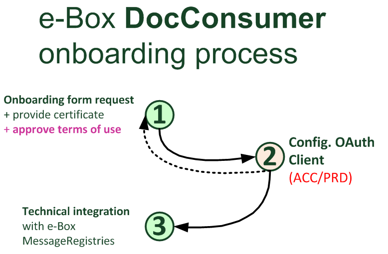

# Onboarding process to become a Document Sender

## Onboarding form request
To become a new e-Box Enterprise DocConsumer, your enterprise needs to send the following documents to [eBoxIntegration@smals.be](mailto:eBoxIntegration@smals.be).
- The public part of the certificate you will use;
- The completed document “[e-Box DocConsumer request form and terms of use](https://info.eboxenterprise.be/fr/documents/word/e-Box_DocConsumer_onboarding_form.docx)”, signed by a Legal Representative of your company.

The certificate needed is a [X.509 certificate](../common/x509_certificate.md).
The request must be sent to [QuoVadis](mailto:info.be@quovadisglobal.com).
Please pay attention to respect the expected format. It’s also important to have a distinct certificate for each work environment (Acceptance, Production).

## OAuth configuration
The e-Box integration team validate your request and configure your enterprise as a new OAuth client.
As a DocConsumer, you will get the necessary scopes to perform all the possible requests to manage your e-Box: 
- **summary_own_ebox** (``scope:document:management:consult:ws-eboxrestentreprise:summaryownebox``) to get the summary of your e-Box; 
- **messages_full** (``scope:document:management:consult:ws-eboxrestentreprise:messagesfull``) to get and perform authorized actions on all messages in your ebox;  
- **reference_data** (``scope:document:management:consult:ws-eboxrestentreprise:referencedata``) to retrieve the details of the messageTypes, senderOrganizations, and senderApplications.

## Technical integration
You can then call the Authorization Server to get your Access token.
With this token, you can [call the different Message Registries](document_consumer.md), in order to retrieve all your e-Box data.
