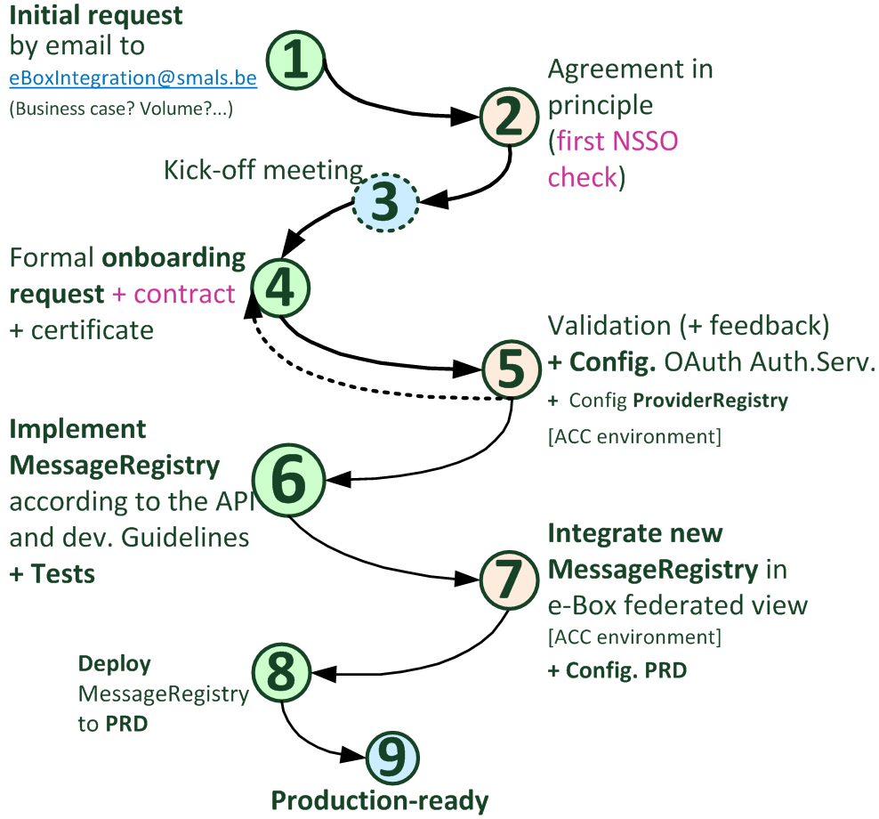

# Onboarding process to become a Document Provider

## 1. DocProvider initial request
First you can contact [eBoxIntegration@smals.be](mailto:eBoxIntegration@smals.be) in order to explain in a high-level way what is expected with you future e-Box integration as new DocProvider, for which business/use cases, and a first idea of the volume (number of provided documents) and the expected planning. 

## 2. Agreement in principle of the NSSO
Before starting any integration, it is necessary to obtain a first agreement in principle from the NSSO. This agreement will be requested by the eBoxIntegration team to the NSSO e-Box managers.

## 3. Kick-off meeting
This step is optional but often very useful in order to answer any questions before starting the technical integration.

## 4. Formal request & contract + certificate
In order to officially become a new DocProvider, please send the following documents to [eBoxIntegration@smals.be](mailto:eBoxIntegration@smals.be):
- e-Box DocProvider onboarding form & contract (the contract must be signed by a Legal Representative from your organization);
- The public part of your certificate;
If you need to order a [X.509 certificate](../common/x509_certificate.md) to [QuoVadis](mailto:info.be@quovadisglobal.com), please pay attention to respect the expected format.
Once completed, the form must be sent.

## 5. Request validation & configuration (ACC)
The eBoxIntegration team is responsible for technically validating the received form. A formal validation of the NSSO is confirmed at this stage. The onboarding with the OAuth2 Authorization Server is managed by our technical teams, based on the information you sent. 

## 6. Implementation and tests 
Here is the main step, when you are going to implement your own MessageRegistry, based on the API and the development guidelines given in the next section. Of course it is important to test your service and the security before proceeding to the next step.

## 7. Integration of your Web Service & configuration (PRD)
At this step, you can deploy a test version of your [MessageRegistry](document_provider.md#MessageRegistryService) that can be integrated into our Acceptance environment. We can then check the integration with the user interface of the federated e-Box. As soon as the verifications are conclusive, we carry out the necessary configurations directly in Production.

## 8. Deploy in Production
You can now deploy your service in the production environment. It is recommended to proceed with the different sanity checks before ‘going live’.

## 9. Production-ready
Your integration with the e-Box system can finally ‘go live’. Congratulations, you are now actually part of the e-Box galaxy!
