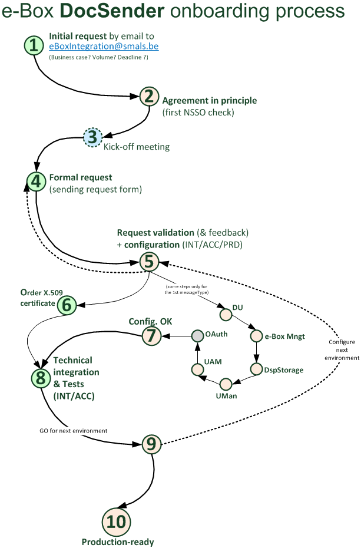

# Onboarding process to become a Document Sender

## DocSender initial request
In practice, a new e-Box integration request can be sent to [eBoxIntegration@smals.be](mailto:eBoxIntegration@smals.be). The first mail should explain in a high-level way what is expected as a new e-Box DocSender, for which business/use cases, a first idea of the volume (number of documents sent, moment of possible load peaks…) and the expected planning. 
Questions can be adressed to this functional mailbox as well.

## Formal request
A formal request must then be submitted via a dedicated form in order to become a new e-Box docSender: [e-Box sending request form](https://info.eboxenterprise.be/fr/documents/word/e-Box_Entreprise_FicheDemandeEnvoi_FR.docx). Once completed, send it to [eBoxIntegration@smals.be](mailto:eBoxIntegration@smals.be).

## Agreement in principle of the NSSO
Before starting any integration, it is necessary to obtain a first agreement in principle from the NSSO. This agreement will be requested by the eBoxIntegration team to the NSSO e-Box managers. 

## Request validation
The eBoxIntegration team is responsible for technically validating the received form. A formal validation of the NSSO is confirmed at this stage. Once validated, the form is sent back to you.

## Order your X.509 certificate
In order to call the e-Box Publication service, you will need a [X.509 certificate](../common/x509_certificate.md).
The request must be sent to [QuoVadis](mailto:info.be@quovadisglobal.com).
Please pay attention to respect the expected format. It’s also important to have a distinct certificate for each work environment (Acceptance, Production).

## Configuration by e-Box team
An email will be sent to you as soon as the configuration is ready to be used.

## e-Box technical integration and tests 
Once the needed configuration is ready, you can proceed to the technical integration with the e-Box system. A very important point is then to test and check that your integration with the e-Box system matches what you wanted. You can request to have test cases via [eBoxIntegration@smals.be](mailto:eBoxIntegration@smals.be).

## Go to next environment
When your tests are completed and conclusive, you can request to move to the following environment (Acceptance; Production), still via [eBoxIntegration@smals.be](mailto:eBoxIntegration@smals.be).

## Production-ready
Once the configuration is ready in the Production environment, your integration with the e-Box system can go “live”. Congratulations, your organization is now a new e-Box DocSender!
